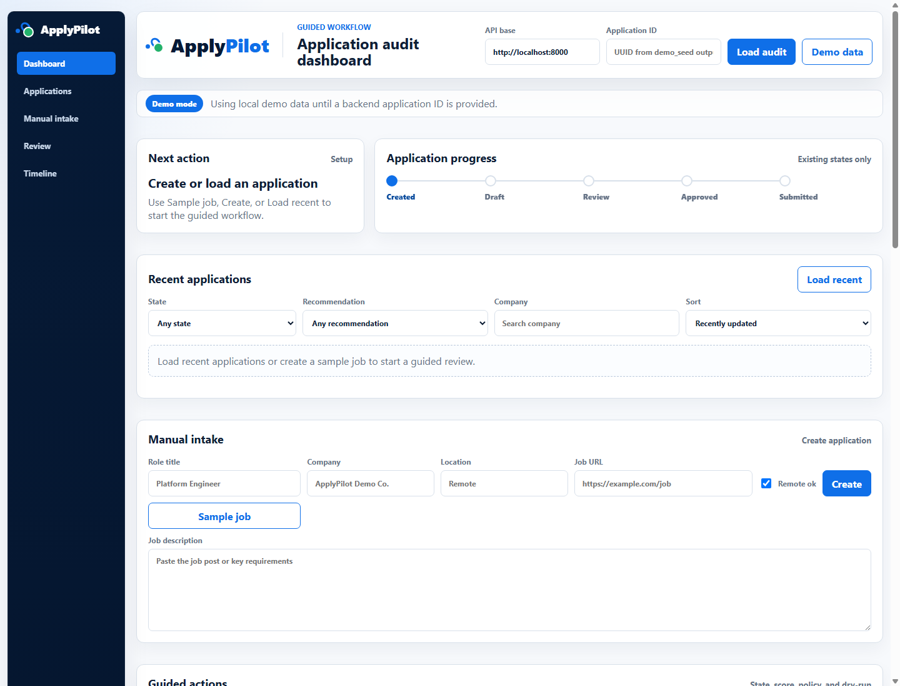
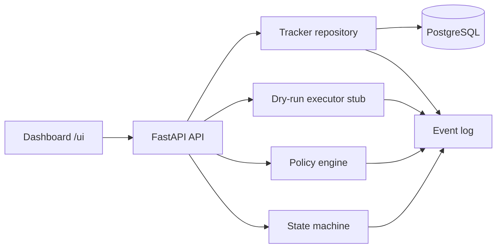

# ApplyPilot

[](https://github.com/NicolayBang/ApplyPilot/actions/workflows/ci.yml)

ApplyPilot is a governed job application automation platform built from the locked OpenClaw architecture baseline.

## Current status

ApplyPilot has an M1 MVP-ready capstone baseline, early M2 packet preparation and review
groundwork, and the M3 company identity database baseline implemented.

The reviewer-facing demo remains the M1 governed workflow: manual intake, deterministic scoring,
policy review, dry-run execution evidence, and audit visibility. M2 and M3 work is present as
controlled platform groundwork; it does not add production automation, live Gmail/browser execution,
or real external submissions.

## Locked architecture principles

- Workflow owns state.
- Database owns truth.
- Policy engine owns permission.
- LLMs are limited to extraction, classification, scoring support, and drafting.
- Workers execute approved actions only through a shared executor contract.
- Dry-run is a first-class platform capability from day one.
- Semi-auto and full-auto are policy modes on the same workflow.

## Implemented baseline

The implemented baseline includes the M1 platform spine:

- Canonical data model and tracker
- Application state machine
- Append-only event log
- Policy engine and automation modes
- Executor contract with `execute` and `dry_run`
- Stub executor that logs planned actions, safeguards, and side-effect status
- Minimal dashboard for tracker, workflow state, scoring, policy, dry-run, review readiness, and audit visibility

It also includes focused post-M1 groundwork:

- M2 packet preview and packet review evidence for human-controlled application preparation
- M3 first-class company identity, including canonical `companies` records and retained raw job
  source text for traceability

No Gmail, browser automation, LLM integration, or real external submission behavior is implemented yet.

## M1 demo path

The current dashboard demo flow is:

```text
manual intake -> parse/classify -> state progression -> scoring -> policy check -> dry-run executor -> review readiness -> audit timeline
```

Useful reviewer entry points:

- `docs/capstone/reviewer-brief.md`: concise capstone/recruiter overview
- `docs/capstone/codespaces-demo.md`: quick Codespaces demo path for reviewers
- `docs/capstone/README.md`: capstone documentation index and suggested reading order
- `docs/capstone/mvp-status.md`: concise current implementation status and MVP boundaries
- `docs/capstone/final-manual-validation-checklist.md`: final human validation pass before presenting
- `docs/capstone/m1-demo-script.md`: short presentation script for the live M1 demo
- `docs/capstone/m1-release-notes.md`: M1 release marker, validation evidence, and handoff summary
- `docs/capstone/dashboard-demo-flow.md`: step-by-step dashboard demo runbook
- `docs/capstone/m1-demo-review-checklist.md`: manual pass/fix checklist for reviewing the M1 demo
- `docs/architecture/current-data-model.md`: implemented data model snapshot through the M3 company identity cutover
- `docs/architecture/database-implementation-roadmap.md`: done/next/future PostgreSQL plan and contract readiness
- `docs/roadmap/m2-kickoff-plan.md`: M2 direction after the M1 MVP-ready baseline
- `docs/roadmap/m2-scope-and-acceptance.md`: scoped M2 acceptance criteria
- `docs/contracts/database-schema-contract.md`: PostgreSQL table and constraint contract for the current baseline
- `docs/diagrams/README.md`: diagram index and diagram authority reminder
- `docs/diagrams/database-schema.md`: separate implemented and planned ER views
- `docs/devops/codespaces.md`: Codespaces and DB-backed validation workflow
- `docs/architecture/locked-plan.md`: architecture authority and M1 scope

The dashboard includes a `Sample job` prefill button so reviewers can run the demo path without manually typing the sample role.



## Implemented M1 architecture



This diagram shows implemented M1 behavior only. Future Gmail, browser, LLM, authentication, and
production deployment work is intentionally excluded from the current MVP.

## Repository layout

- `backend/`: FastAPI backend, domain boundaries, and worker placeholders
- `frontend/`: static M1 audit dashboard served by the backend at `/ui`
- `docs/architecture/`: implementation notes tied to the locked plan

## Initial stack

- Backend: FastAPI
- Database: PostgreSQL
- Queue/cache: Redis
- Browser automation: Playwright later
- Email: Gmail API later
- Documents: docxtpl / python-docx later
- Deployment: Docker Compose first

## Getting started

1. Copy `.env.example` to `.env` and adjust values.
2. Start local services with Docker Compose.
3. Run database migrations.
4. Create a Python virtual environment inside `backend/`.
5. Install backend dependencies.
6. Run the FastAPI app.

Example commands:

```powershell
Copy-Item .env.example .env
docker compose up -d postgres redis
docker compose run --rm migrate
cd backend
python -m venv .venv
.\.venv\Scripts\Activate.ps1
pip install -e .
uvicorn applypilot.main:app --reload
```

To run the packaged backend and dashboard through Docker after migrations:

```powershell
docker compose --profile app up -d api
```

Then open `http://localhost:8000/ui/`.

## Validation

For DB-backed validation in Codespaces or local Docker, use `docs/devops/codespaces.md`.

The current validation path runs migrations, backend tests, and the seed-to-dashboard check:

```powershell
docker compose up -d postgres redis
docker compose run --rm migrate
cd backend
python -m pytest
python -m scripts.validate_seed_to_dashboard
```

When PostgreSQL is available, the backend test suite also exercises database constraints, audit
retention, packet review persistence, and the M3 company identity cutover regression path.

The Compose migration runner uses the same Alembic migration chain as local backend commands. For
an optional demo seed and audit validation inside Compose, run:

```powershell
docker compose --profile demo run --rm seed
```

## M1 demo definition of done

- Create an application record
- Parse and classify basic job metadata
- Transition through states
- Log every event
- Evaluate policy
- Simulate an executor action in dry-run with plan details and no side effects
- Inspect it in the dashboard
- Inspect review readiness and audit evidence in the dashboard

## Non-goals in v1

- Multi-account orchestration
- Captcha bypassing or anti-bot evasion
- Autonomous custom, salary, legal, or disclosure answers
- Unsupported ATS flows
- Full event sourcing
- LLM access to credentials

## AI-assisted development

AI tools were used for pair programming, review, documentation drafting, and validation prompts.
Final architecture decisions, scope control, testing expectations, and merge decisions were
human-owned. The repository keeps implemented behavior separate from proposed future work through
contracts, ADRs, CI checks, and capstone validation docs.
