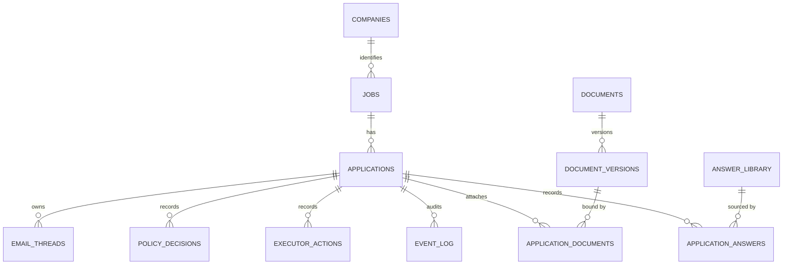

# Current Data Model

**Status:** Implemented snapshot  
**Scope:** Implemented backend schema through the M5 document/answer library cutover
**Database:** PostgreSQL  
**Source of truth:** SQLAlchemy models and Alembic migrations

This document describes the data model currently implemented in `backend/src/applypilot/db/models.py` and the active Alembic migration chain.

It is not a future-state schema proposal. If this document conflicts with the code or migrations, treat this document as stale and update it.

Detailed columns and constraint layers are defined in
`docs/contracts/database-schema-contract.md`. Current and future ER views are separated in
`docs/diagrams/database-schema.md`.

## Provisioning

The Compose `postgres` service starts an empty PostgreSQL server. ApplyPilot tables exist only
after the migration chain is applied:

```bash
docker compose up -d postgres
docker compose run --rm migrate
```

The Docker image and local named volume are not repository artifacts. Teammates reproduce the
schema from migrations.

## Migration Chain

Current migrations:

1. `0001_initial_schema.py`
2. `0002_policy_decision_outcomes.py`
3. `0003_preserve_event_log_on_application_delete.py`
4. `0004_align_application_state_default.py`
5. `0005_add_executor_contract_metadata.py`
6. `0006_add_m1_value_check_constraints.py`
7. `0007_retain_policy_and_executor_audit.py`
8. `0008_add_application_packet_reviews.py`
9. `0009_add_company_identity_schema.py`
10. `0010_backfill_job_company_identity.py`
11. `0011_complete_company_identity_cutover.py`
12. `0012_add_m5_document_answer_schema.py`
13. `0013_make_documents_application_id_nullable.py`
14. `0014_remove_documents_legacy_compatibility.py`

Migrations `0012`–`0014` implement the M5 reusable document/answer library: `0012`
transforms the M1 placeholder `documents` table into a logical library and adds the
immutable/append-only M5 tables with a deterministic legacy backfill; `0013` relaxes the
legacy `documents.application_id` to nullable during the compatibility window; and `0014`
removes the legacy single-owner columns, index, and foreign key after the M5 read-model
API switched off them. The relational direction remains governed by ADR-0002 (Proposed).

## Core Shape



`applications` is the canonical hub record. Workflow state, scoring, policy decisions, executor records, email threads, and audit events all attach to an application. Since the M5 cutover, `documents` is a standalone reusable library that no application owns directly: an application uses a document only through an `application_documents` attachment binding one exact, immutable `document_versions` row.

`companies` is the canonical company identity table for the implemented M3 cutover. API and
dashboard behavior still expose a display `company` value for compatibility, but that value is now
projected from `companies.name`; raw intake provenance is retained as `jobs.company_source_text`.

## Tables

### `jobs`

Normalized job posting data.

Blank `job_type`, `ats_type`, `salary_raw`, and `remote_ok` fields may be enriched by the deterministic job intake classifier during job creation. This is implemented behavior, not an LLM call.

```text
id uuid PK
source_url varchar(2048) nullable
raw_text text nullable
title varchar(512) nullable
company_source_text varchar(256) nullable
company_id uuid not null FK -> companies.id
location varchar(256) nullable
remote_ok boolean not null default false
job_type varchar(64) nullable
ats_type varchar(64) nullable
salary_raw varchar(256) nullable
created_at timestamptz not null
updated_at timestamptz not null
```

Indexes:

```text
ix_jobs_company_source_text(company_source_text)
ix_jobs_company_id(company_id)
```

Migration `0010` backfills existing rows and new job writes resolve or create deterministic company
identity records. Migration `0011` completes the cutover by requiring `company_id` and renaming the
raw source/provenance column to `company_source_text`. API read models keep the compatible display
`company` field projected from `companies.name`.

### `companies`

Canonical company identity records introduced for the M3 compatibility path.

```text
id uuid PK
name varchar(256) not null
normalized_name varchar(256) not null
domain varchar(256) nullable
normalized_domain varchar(256) nullable
created_at timestamptz not null
updated_at timestamptz not null
```

Indexes and constraints:

```text
ix_companies_normalized_name(normalized_name)
ix_companies_normalized_domain(normalized_domain)
uq_companies_normalized_domain_m3(normalized_domain) where normalized_domain is not null
uq_companies_normalized_name_without_domain_m3(normalized_name) where normalized_domain is null
ck_companies_name_not_blank_m3
ck_companies_normalized_name_not_blank_m3
```

### `applications`

Canonical application hub.

```text
id uuid PK
job_id uuid FK -> jobs.id on delete cascade
state varchar(64) not null default ApplicationCreated
automation_mode varchar(32) not null default manual
fit_score integer nullable
confidence varchar(16) nullable
recommendation varchar(32) nullable
score_reasons jsonb nullable
score_risks jsonb nullable
missing_data jsonb nullable
red_flags jsonb nullable
created_at timestamptz not null
updated_at timestamptz not null
```

Implemented states:

```text
ApplicationCreated
Draft
ReadyForReview
Approved
Submitted
Rejected
Archived
```

Migration `0004` aligns the database default with the ORM and implemented state machine value
`ApplicationCreated`.

State and automation-mode values are enforced by named PostgreSQL `CHECK` constraints. Confidence
and recommendation remain application-owned scoring outputs while their vocabulary stabilizes.

Indexes:

```text
ix_applications_state(state)
ix_applications_job_id(job_id)
ck_applications_state_m1
ck_applications_automation_mode_m1
```

### `documents` (M5 reusable logical library)

The stable logical identity of a reusable document (resume, cover letter, supporting,
other). A `documents` row owns no content directly and has no owning application; content
lives only in immutable `document_versions`, and an application uses a document only
through an `application_documents` attachment. Migration `0014` removed the legacy
single-owner columns (`application_id`, `content`, `content_json`, `version`) and the
`ix_documents_application_id` index.

```text
id uuid PK
doc_type varchar(64) not null
name varchar(256) not null
is_archived boolean not null default false
created_at timestamptz not null
updated_at timestamptz not null
```

Indexes and constraints:

```text
ix_documents_doc_type(doc_type)
ix_documents_is_archived(is_archived)
ck_documents_doc_type_m5    (doc_type IN ('resume','cover_letter','supporting','other'))
ck_documents_name_not_blank_m5    (name <> '')
```

### `document_versions` (immutable rendered versions)

Frozen, immutable renderings of one logical document. Never updated after insert;
corrections append a new version. `ON DELETE RESTRICT` on `document_id` preserves history.

```text
id uuid PK
document_id uuid FK -> documents.id on delete restrict
version_number integer not null
content text nullable
content_json jsonb nullable
checksum varchar(128) not null
created_at timestamptz not null
```

Indexes and constraints:

```text
ix_document_versions_document_id(document_id)
ix_document_versions_checksum(checksum)
uq_document_versions_document_id_version_number_m5(document_id, version_number) unique
ck_document_versions_version_positive_m5    (version_number > 0)
ck_document_versions_payload_present_m5    (content IS NOT NULL OR content_json IS NOT NULL)
```

### `application_documents` (append-only attachment of an exact version)

Binds one exact, immutable `document_versions` row to one application. Append-only:
attaching a newer version is a new row, never a silent upgrade. `ON DELETE RESTRICT` on
both foreign keys preserves attachment history.

```text
id uuid PK
application_id uuid FK -> applications.id on delete restrict
document_version_id uuid FK -> document_versions.id on delete restrict
role varchar(64) not null
display_order integer not null
created_at timestamptz not null
```

Indexes and constraints:

```text
ix_application_documents_application_id(application_id)
ix_application_documents_document_version_id(document_version_id)
uq_application_documents_app_version_role_m5(application_id, document_version_id, role) unique
ck_application_documents_role_m5    (role IN ('resume','cover_letter','supporting','other'))
ck_application_documents_display_order_non_negative_m5    (display_order >= 0)
```

### `answer_library` (current reusable answers)

Current, reusable question/answer records. Library answers are mutable (edit/archive in
place); historical truth is preserved separately in immutable `application_answers`
snapshots, never by mutating the library.

```text
id uuid PK
question_key varchar(256) not null
question_text text not null
answer_text text not null
is_archived boolean not null default false
created_at timestamptz not null
updated_at timestamptz not null
```

Indexes and constraints:

```text
ix_answer_library_question_key(question_key)
ix_answer_library_is_archived(is_archived)
uq_answer_library_question_key_active_m5(question_key) unique where is_archived is false
ck_answer_library_question_key_not_blank_m5    (question_key <> '')
```

### `application_answers` (immutable answer snapshots)

The immutable question/answer used by an application, with optional library provenance. A
later edit or archive of the referenced library row never changes this snapshot.
`ON DELETE RESTRICT` on `answer_library_id` preserves provenance.

```text
id uuid PK
application_id uuid FK -> applications.id on delete restrict
answer_library_id uuid FK -> answer_library.id on delete restrict nullable
question_key varchar(256) not null
question_text text not null
answer_text text not null
created_at timestamptz not null
```

Indexes and constraints:

```text
ix_application_answers_application_id(application_id)
ix_application_answers_answer_library_id(answer_library_id)
uq_application_answers_app_question_key_m5(application_id, question_key) unique
ck_application_answers_question_key_not_blank_m5    (question_key <> '')
```

### `email_threads`

Recruiter or application-related email thread records.

```text
id uuid PK
application_id uuid FK -> applications.id on delete cascade
external_thread_id varchar(256) nullable
subject varchar(512) nullable
direction varchar(16) not null default inbound
classification varchar(64) nullable
raw_body text nullable
draft_reply text nullable
sent_at timestamptz nullable
created_at timestamptz not null
```

Indexes:

```text
ix_email_threads_application_id(application_id)
ck_email_threads_direction_m1
```

### `policy_decisions`

Persisted policy gate evaluations. Policy decisions are recorded before executor actions.

```text
id uuid PK
application_id uuid FK -> applications.id
action_type varchar(64) not null
mode varchar(32) not null
decision varchar(16) not null default review
allowed boolean not null
reasons jsonb nullable
risks jsonb nullable
required_overrides jsonb nullable
created_at timestamptz not null
```

Indexes:

```text
ix_policy_decisions_application_id(application_id)
ck_policy_decisions_mode_m1
ck_policy_decisions_decision_m1
```

### `executor_actions`

Execution or dry-run records for approved worker actions.

```text
id uuid PK
request_id uuid unique not null
application_id uuid FK -> applications.id
worker varchar(32) not null
idempotency_key varchar(256) unique not null
action_type varchar(64) not null
execution_mode varchar(16) not null
status varchar(32) not null default queued
requested_by varchar(64) not null
requested_at timestamptz not null
payload jsonb nullable
result jsonb nullable
created_at timestamptz not null
completed_at timestamptz nullable
```

Indexes:

```text
ix_executor_actions_application_id(application_id)
ix_executor_actions_request_id(request_id)
ix_executor_actions_idempotency_key(idempotency_key)
ck_executor_actions_execution_mode_m1
ck_executor_actions_status_m1
ck_executor_actions_worker_m1
```

### `event_log`

Append-only audit log for application creation, state transitions, policy decisions, executor attempts, and executor results.

```text
id uuid PK
application_id uuid FK -> applications.id
event_type varchar(128) not null
actor varchar(64) not null default system
from_state varchar(64) nullable
to_state varchar(64) nullable
payload jsonb nullable
created_at timestamptz not null
```

Important rule:

```text
event_log.application_id does not cascade on application delete
Application.events also avoids ORM delete/delete-orphan cascade
```

Migration `0003` preserves audit history at the database foreign-key layer. The SQLAlchemy
relationship also avoids delete/delete-orphan cascade and uses passive deletes. Consumers should
treat the event log as append-only.

Indexes:

```text
ix_event_log_application_id(application_id)
ix_event_log_event_type(event_type)
ix_event_log_created_at(created_at)
```

## Implemented Rules

- PostgreSQL is the durable system of record.
- `applications` is the central aggregate for M1.
- Job creation may deterministically enrich blank job metadata from manual intake.
- Job creation resolves deterministic company identity for new writes while preserving raw intake
  provenance as `jobs.company_source_text`.
- Application state transitions go through the state machine.
- New application rows default to `ApplicationCreated` at both ORM and database levels.
- Application creation and state changes append event log records.
- Policy decisions are persisted before executor actions.
- Executor actions use a unique idempotency key.
- Executor dry-run and result records append audit events.
- The event-log database FK does not cascade on application delete.
- Policy decision and executor action FKs do not cascade on application delete.
- Companies own canonical company identity. Existing consumers still read the compatible display
  company value through API projection.

## Validation Boundaries

Database-enforced:

- Primary and foreign keys.
- Required versus nullable columns.
- Executor idempotency-key uniqueness.
- Declared indexes and server defaults.
- Event-log FK without `ON DELETE CASCADE`.
- Stable M1 state, mode, policy, executor, worker, and email direction values.

Application-enforced:

- Valid state transitions.
- Confidence and recommendation scoring vocabularies.
- Policy decision before the dry-run executor endpoint.
- Event append ordering in Tracker/API workflows.

## Alignment Register

| Area | Status | Evidence / next action |
|---|---|---|
| Application DB default differs from state machine | Resolved by #47 | Migration `0004` and ORM default use `ApplicationCreated` |
| ORM event delete cascade conflicts with append-only rule | Resolved by #47 | Database FK does not cascade; ORM relationship uses passive deletes |
| Event contract vocabulary differs from implementation | Resolved by #48 | Contract uses `id`, `event_type`, and implemented event names |
| Stable enum-like strings lack PostgreSQL checks | Resolved by ADR-0003 / migration `0006` | Named M1 `CHECK` constraints enforce stable values |
| Policy/executor records cascade with application | Resolved by ADR-0004 / migration `0007` | Restrictive physical deletion preserves M1 audit-bearing records |
| PostgreSQL schema creation is reproducible | Resolved | Compose starts PostgreSQL; the `migrate` service applies Alembic; the optional `seed` service validates the demo flow |
| Normalized company identity | Resolved for M3 baseline | Migration `0009` adds `companies`; migration `0010` backfills legacy rows; migration `0011` requires `jobs.company_id` and renames provenance to `jobs.company_source_text`; API reads project display company from `companies.name` |
| Normalized document/answer model (M5) | Resolved for M5 baseline | Migrations `0012`–`0014` implement the reusable `documents` library, immutable `document_versions`, append-only `application_documents`, mutable `answer_library`, and immutable `application_answers`; the read-model API reads exclusively from them. ADR-0002 remains Proposed as the governing direction |
| Normalized thread/contact model (M7) | Deferred | The M7 `contacts`/`threads`/`messages` model remains proposed in ADR-0002 |

## Current Non-Goals

The following are not implemented as separate schema tables:

- `contacts`
- `threads`
- `messages`
- `thread_applications`

These may be introduced later through new migrations and architecture review.

The M5 document/answer tables (`document_versions`, `application_documents`,
`answer_library`, `application_answers`) are implemented by migrations `0012`–`0014` and
are documented above. The remaining phase placement is:

- M7: `contacts`, `threads`, `messages`, `thread_applications`

ADR-0005 specifically approves the M3 company identity direction. Migration `0009` starts the
compatibility schema, and migration `0010` backfills legacy job rows. API reads now project company
display from `companies.name`. Migration `0011` completes the M3 baseline cutover by enforcing
non-null `jobs.company_id` and renaming raw provenance to `jobs.company_source_text`. Migrations
`0012`–`0014` then implement the M5 document/answer library and retire the legacy single-owner
`documents` columns. ADR-0002 remains **Proposed** as the governing relational direction for the M5
(implemented) and M7 (deferred) normalization; its approval is recorded as governance status, not as
authorization already granted. The M7 tables listed above are not yet authorized for migration.
