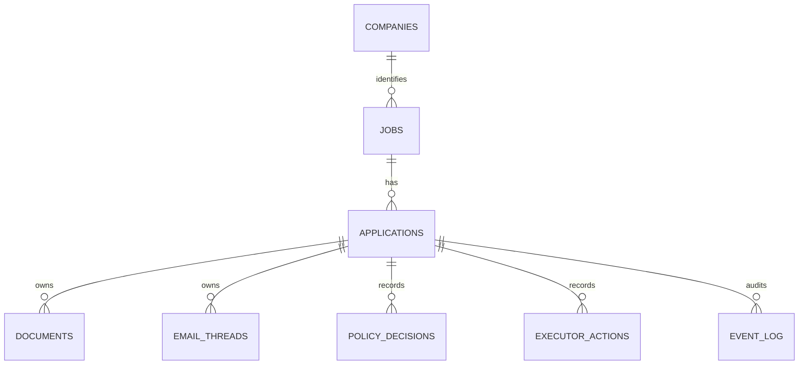

# Current Data Model

**Status:** Implemented snapshot  
**Scope:** Implemented backend schema through the M3 company identity compatibility step
**Database:** PostgreSQL  
**Source of truth:** SQLAlchemy models and Alembic migrations

This document describes the data model currently implemented in `backend/src/applypilot/db/models.py` and the active Alembic migration chain.

It is not a future-state schema proposal. If this document conflicts with the code or migrations, treat this document as stale and update it.

Detailed columns and constraint layers are defined in
`docs/contracts/database-schema-contract.md`. Current and future ER views are separated in
`docs/diagrams/database-schema.md`.

## Provisioning

The Compose `postgres` service starts an empty PostgreSQL server. ApplyPilot tables exist only
after the migration chain is applied:

```bash
docker compose up -d postgres
docker compose run --rm migrate
```

The Docker image and local named volume are not repository artifacts. Teammates reproduce the
schema from migrations.

## Migration Chain

Current migrations:

1. `0001_initial_schema.py`
2. `0002_policy_decision_outcomes.py`
3. `0003_preserve_event_log_on_application_delete.py`
4. `0004_align_application_state_default.py`
5. `0005_add_executor_contract_metadata.py`
6. `0006_add_m1_value_check_constraints.py`
7. `0007_retain_policy_and_executor_audit.py`
8. `0008_add_application_packet_reviews.py`
9. `0009_add_company_identity_schema.py`

## Core Shape



`applications` is the canonical hub record. Workflow state, scoring, policy decisions, executor records, documents, email threads, and audit events all attach to an application.

`companies` is present as the first M3 compatibility schema step. Existing API and dashboard
behavior still expose `jobs.company` as the current display value until a later backfill/cutover
migration changes canonical reads and writes.

## Tables

### `jobs`

Normalized job posting data.

Blank `job_type`, `ats_type`, `salary_raw`, and `remote_ok` fields may be enriched by the deterministic job intake classifier during job creation. This is implemented behavior, not an LLM call.

```text
id uuid PK
source_url varchar(2048) nullable
raw_text text nullable
title varchar(512) nullable
company varchar(256) nullable
company_id uuid nullable FK -> companies.id
location varchar(256) nullable
remote_ok boolean not null default false
job_type varchar(64) nullable
ats_type varchar(64) nullable
salary_raw varchar(256) nullable
created_at timestamptz not null
updated_at timestamptz not null
```

Indexes:

```text
ix_jobs_company(company)
ix_jobs_company_id(company_id)
```

During the M3 compatibility period, `company` remains the existing display/source text and
`company_id` is nullable. Later M3 work must backfill and cut over canonical company reads before
`company_id` becomes required.

### `companies`

Canonical company identity records introduced for the M3 compatibility path.

```text
id uuid PK
name varchar(256) not null
normalized_name varchar(256) not null
domain varchar(256) nullable
normalized_domain varchar(256) nullable
created_at timestamptz not null
updated_at timestamptz not null
```

Indexes and constraints:

```text
ix_companies_normalized_name(normalized_name)
ix_companies_normalized_domain(normalized_domain)
uq_companies_normalized_domain_m3(normalized_domain) where normalized_domain is not null
uq_companies_normalized_name_without_domain_m3(normalized_name) where normalized_domain is null
ck_companies_name_not_blank_m3
ck_companies_normalized_name_not_blank_m3
```

### `applications`

Canonical application hub.

```text
id uuid PK
job_id uuid FK -> jobs.id on delete cascade
state varchar(64) not null default ApplicationCreated
automation_mode varchar(32) not null default manual
fit_score integer nullable
confidence varchar(16) nullable
recommendation varchar(32) nullable
score_reasons jsonb nullable
score_risks jsonb nullable
missing_data jsonb nullable
red_flags jsonb nullable
created_at timestamptz not null
updated_at timestamptz not null
```

Implemented states:

```text
ApplicationCreated
Draft
ReadyForReview
Approved
Submitted
Rejected
Archived
```

Migration `0004` aligns the database default with the ORM and implemented state machine value
`ApplicationCreated`.

State and automation-mode values are enforced by named PostgreSQL `CHECK` constraints. Confidence
and recommendation remain application-owned scoring outputs while their vocabulary stabilizes.

Indexes:

```text
ix_applications_state(state)
ix_applications_job_id(job_id)
ck_applications_state_m1
ck_applications_automation_mode_m1
```

### `documents`

Generated application documents such as CV bullets, cover notes, and screening answers.

```text
id uuid PK
application_id uuid FK -> applications.id on delete cascade
doc_type varchar(64) not null
content text nullable
content_json jsonb nullable
version integer not null default 1
created_at timestamptz not null
```

Indexes:

```text
ix_documents_application_id(application_id)
```

### `email_threads`

Recruiter or application-related email thread records.

```text
id uuid PK
application_id uuid FK -> applications.id on delete cascade
external_thread_id varchar(256) nullable
subject varchar(512) nullable
direction varchar(16) not null default inbound
classification varchar(64) nullable
raw_body text nullable
draft_reply text nullable
sent_at timestamptz nullable
created_at timestamptz not null
```

Indexes:

```text
ix_email_threads_application_id(application_id)
ck_email_threads_direction_m1
```

### `policy_decisions`

Persisted policy gate evaluations. Policy decisions are recorded before executor actions.

```text
id uuid PK
application_id uuid FK -> applications.id
action_type varchar(64) not null
mode varchar(32) not null
decision varchar(16) not null default review
allowed boolean not null
reasons jsonb nullable
risks jsonb nullable
required_overrides jsonb nullable
created_at timestamptz not null
```

Indexes:

```text
ix_policy_decisions_application_id(application_id)
ck_policy_decisions_mode_m1
ck_policy_decisions_decision_m1
```

### `executor_actions`

Execution or dry-run records for approved worker actions.

```text
id uuid PK
request_id uuid unique not null
application_id uuid FK -> applications.id
worker varchar(32) not null
idempotency_key varchar(256) unique not null
action_type varchar(64) not null
execution_mode varchar(16) not null
status varchar(32) not null default queued
requested_by varchar(64) not null
requested_at timestamptz not null
payload jsonb nullable
result jsonb nullable
created_at timestamptz not null
completed_at timestamptz nullable
```

Indexes:

```text
ix_executor_actions_application_id(application_id)
ix_executor_actions_request_id(request_id)
ix_executor_actions_idempotency_key(idempotency_key)
ck_executor_actions_execution_mode_m1
ck_executor_actions_status_m1
ck_executor_actions_worker_m1
```

### `event_log`

Append-only audit log for application creation, state transitions, policy decisions, executor attempts, and executor results.

```text
id uuid PK
application_id uuid FK -> applications.id
event_type varchar(128) not null
actor varchar(64) not null default system
from_state varchar(64) nullable
to_state varchar(64) nullable
payload jsonb nullable
created_at timestamptz not null
```

Important rule:

```text
event_log.application_id does not cascade on application delete
Application.events also avoids ORM delete/delete-orphan cascade
```

Migration `0003` preserves audit history at the database foreign-key layer. The SQLAlchemy
relationship also avoids delete/delete-orphan cascade and uses passive deletes. Consumers should
treat the event log as append-only.

Indexes:

```text
ix_event_log_application_id(application_id)
ix_event_log_event_type(event_type)
ix_event_log_created_at(created_at)
```

## Implemented Rules

- PostgreSQL is the durable system of record.
- `applications` is the central aggregate for M1.
- Job creation may deterministically enrich blank job metadata from manual intake.
- Application state transitions go through the state machine.
- New application rows default to `ApplicationCreated` at both ORM and database levels.
- Application creation and state changes append event log records.
- Policy decisions are persisted before executor actions.
- Executor actions use a unique idempotency key.
- Executor dry-run and result records append audit events.
- The event-log database FK does not cascade on application delete.
- Policy decision and executor action FKs do not cascade on application delete.
- Companies exist as the M3 compatibility table, but existing consumers still read the display
  company value from `jobs.company`.

## Validation Boundaries

Database-enforced:

- Primary and foreign keys.
- Required versus nullable columns.
- Executor idempotency-key uniqueness.
- Declared indexes and server defaults.
- Event-log FK without `ON DELETE CASCADE`.
- Stable M1 state, mode, policy, executor, worker, and email direction values.

Application-enforced:

- Valid state transitions.
- Confidence and recommendation scoring vocabularies.
- Policy decision before the dry-run executor endpoint.
- Event append ordering in Tracker/API workflows.

## Alignment Register

| Area | Status | Evidence / next action |
|---|---|---|
| Application DB default differs from state machine | Resolved by #47 | Migration `0004` and ORM default use `ApplicationCreated` |
| ORM event delete cascade conflicts with append-only rule | Resolved by #47 | Database FK does not cascade; ORM relationship uses passive deletes |
| Event contract vocabulary differs from implementation | Resolved by #48 | Contract uses `id`, `event_type`, and implemented event names |
| Stable enum-like strings lack PostgreSQL checks | Resolved by ADR-0003 / migration `0006` | Named M1 `CHECK` constraints enforce stable values |
| Policy/executor records cascade with application | Resolved by ADR-0004 / migration `0007` | Restrictive physical deletion preserves M1 audit-bearing records |
| PostgreSQL schema creation is reproducible | Resolved | Compose starts PostgreSQL; the `migrate` service applies Alembic; the optional `seed` service validates the demo flow |
| Normalized company identity | In progress for M3 | Migration `0009` adds `companies` and nullable `jobs.company_id`; backfill, canonical read/write cutover, non-null enforcement, and `company_source_text` rename remain future M3 work |
| Normalized document/thread/answer model | Deferred | The broader M5/M7 model remains proposed in ADR-0002 |

## Current Non-Goals

The following are not implemented as separate schema tables:

- `contacts`
- `document_versions`
- `application_documents`
- `threads`
- `messages`
- `thread_applications`
- `answer_library`
- `application_answers`

These may be introduced later through new migrations and architecture review.

The proposed phase placement is:

- M3: remaining company backfill, cutover, required `jobs.company_id`, and
  `company_source_text` rename
- M5: `document_versions`, `application_documents`, `answer_library`,
  `application_answers`
- M7: `contacts`, `threads`, `messages`, `thread_applications`

ADR-0005 specifically approves the M3 company identity direction. Migration `0009` starts the
compatibility schema only; M3 is not complete until backfill, canonical reads/writes, non-null
`jobs.company_id`, and the `company_source_text` rename are implemented and validated. ADR-0002
remains Proposed for the broader M5/M7 normalization direction. No future table listed here is
currently authorized for migration.
