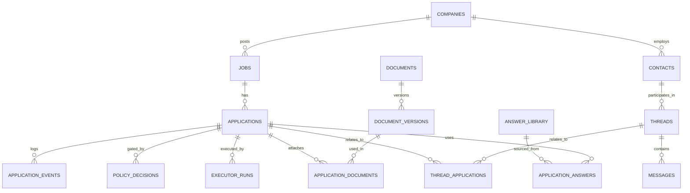

# ApplyPilot Data Schema v0

**Status:** Draft  
**Database:** PostgreSQL  
**Purpose:** Initial shared data model for review before implementation.

This schema is not locked yet. It combines the current project direction with the proposed v2 domain model.

## Core ERD



## Phase 1 Tables

### `companies`

```text
id uuid PK
name varchar(256)
domain varchar(256) nullable
created_at timestamptz
updated_at timestamptz
```

### `jobs`

```text
id uuid PK
company_id uuid FK -> companies.id
title varchar
job_url varchar nullable
description text nullable
created_at timestamptz
updated_at timestamptz
```

### `applications`

```text
id uuid PK
job_id uuid FK -> jobs.id
lifecycle_state varchar(64)
packet_state varchar(32)
submission_state varchar(32)
created_at timestamptz
updated_at timestamptz
```

Draft state columns:

```text
lifecycle_state: pending ADR-001
packet_state: none | drafting | ready | approved
submission_state: not_started | dry_run_ok | submitting | submitted | failed
```

### `application_events`

```text
id uuid PK
application_id uuid FK -> applications.id
event_type varchar
actor varchar nullable
from_state varchar nullable
to_state varchar nullable
payload jsonb
created_at timestamptz
```

Rule:

```text
Append-only. Do not cascade-delete audit history.
```

### `policy_decisions`

```text
id uuid PK
application_id uuid FK -> applications.id
action_type varchar
mode varchar
allowed boolean
reasons jsonb
risks jsonb
created_at timestamptz
```

### `executor_runs`

```text
id uuid PK
application_id uuid FK -> applications.id
action_type varchar
execution_mode varchar
status varchar
idempotency_key varchar unique
attempt integer
max_attempts integer
rate_limit_key varchar nullable
last_error text nullable
next_retry_at timestamptz nullable
result jsonb
created_at timestamptz
updated_at timestamptz
```

## Future Tables

```text
contacts
documents
document_versions
application_documents
threads
messages
thread_applications
answer_library
application_answers
```

## Key Rules

- PostgreSQL is the system of record.
- Redis is optional/future-facing only.
- Applications are the central aggregate.
- State changes must go through the state machine.
- Every state transition writes an application event.
- Event history must remain append-only.
- Many-to-many relationships use explicit join tables.
- This document is v0 draft and requires Nicolay + Francis review before becoming authoritative.
