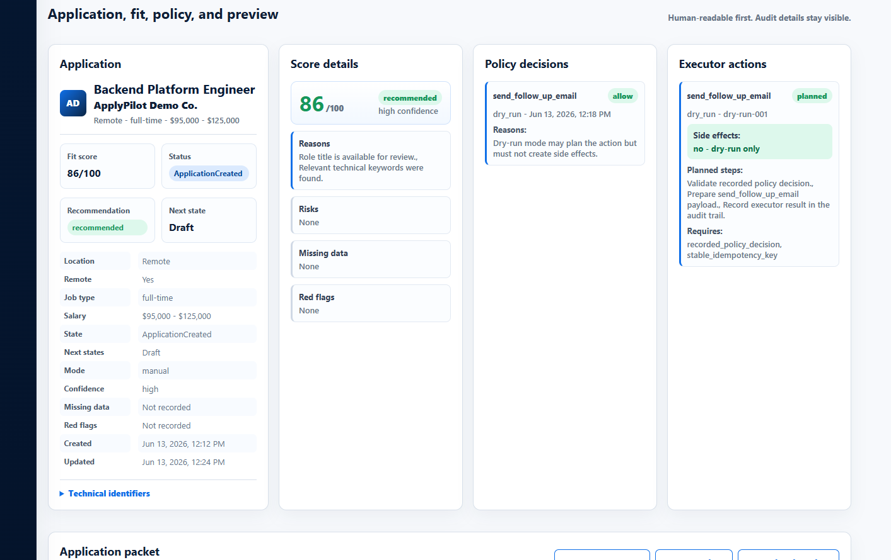

# ApplyGo Reviewer Quickstart

**Audience:** recruiters, instructors, and technical reviewers
**Time:** 2-5 minutes
**Purpose:** show the implemented capstone baseline quickly without sending reviewers into future-scope docs

## What ApplyGo Is

ApplyGo is a governed job application automation platform. The current public repository proves the
implemented backend workflow and reviewer dashboard:

- manual job intake;
- deterministic scoring and classification;
- policy review before executor actions;
- dry-run executor evidence with no external side effects;
- append-only audit visibility across the workflow.

This is intentionally a capstone baseline, not a finished product. Gmail automation, browser
automation, LLM drafting, production hosting, and real external submission are not implemented yet.

## What To Look At

### 1. Review the current dashboard evidence

This is the clearest single screenshot for understanding the implemented experience:

What this screenshot shows:

- one application moving through a governed workflow;
- score details separated from policy decisions and executor evidence;
- explicit dry-run planning instead of hidden automation;
- visible reviewer-facing data instead of raw backend internals only.

### 2. Confirm the product story in one short doc

Read [`reviewer-brief.md`](reviewer-brief.md).

That brief explains what was built, what was intentionally deferred, and why the project should be
read as an engineering capstone baseline.

### 3. Confirm current scope and boundaries

Read [`mvp-status.md`](mvp-status.md).

This is the fastest way to verify what is implemented now versus what remains future work.

## If You Want A Slightly Deeper Pass

Read these next:

1. [`m1-release-notes.md`](m1-release-notes.md)
2. [`codespaces-demo.md`](codespaces-demo.md)
3. [`dashboard-demo-flow.md`](dashboard-demo-flow.md)

## What Reviewers Should Take Away

- workflow state is explicit and database-backed;
- policy gates executor behavior;
- dry-run is a first-class safety path;
- audit events make decisions and system behavior inspectable;
- the repo is disciplined about implemented scope versus future roadmap.
