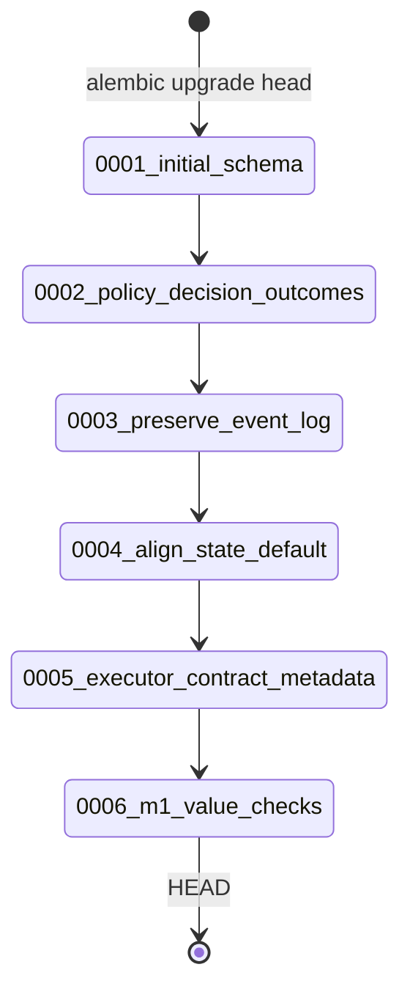
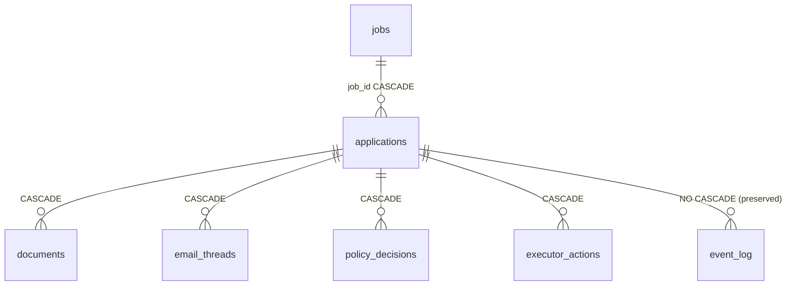

# C4 Code Level: Database Migration Versions

## Overview

- **Name**: Alembic Migration Versions
- **Description**: Versioned database schema migration scripts that define the full evolution of ApplyPilot's PostgreSQL schema. Six migrations establish the canonical application hub, policy decision outcomes, audit trail preservation, the M1 application state default, executor contract metadata, and M1 value checks.
- **Location**: `backend/alembic/versions/`
- **Language**: Python (Alembic DDL)
- **Purpose**: Create and evolve the PostgreSQL schema via incremental, reversible migrations. Each migration advances the schema revision chain: `0001 -> 0002 -> 0003 -> 0004 -> 0005 -> 0006`.

---

## Code Elements

### 0001_initial_schema.py - Initial Schema

**Revision:** `0001` | **Depends on:** none (root)

#### `upgrade() -> None`

Creates the complete initial schema with 7 tables and 11 indexes.

**Tables created (in dependency order):**

| Table | Purpose | Key Columns |
|-------|---------|-------------|
| `jobs` | Normalized job postings | `id UUID PK`, `title`, `company`, `location`, `remote_ok`, `job_type`, `ats_type`, `salary_raw`, `raw_text` |
| `applications` | Canonical hub record | `id UUID PK`, `job_id FK->jobs`, `state`, `automation_mode`, `fit_score`, `confidence`, `recommendation`, `score_reasons JSONB`, `score_risks JSONB`, `missing_data JSONB`, `red_flags JSONB` |
| `documents` | Generated documents | `id UUID PK`, `application_id FK->applications CASCADE` |
| `email_threads` | Recruiter email conversations | `id UUID PK`, `application_id FK->applications CASCADE`, `direction`, `classification` |
| `policy_decisions` | Policy gate evaluations | `id UUID PK`, `application_id FK->applications CASCADE`, `action_type`, `mode`, `allowed BOOL` |
| `executor_actions` | Execution audit records | `id UUID PK`, `application_id FK->applications CASCADE`, `idempotency_key UNIQUE`, `status`, `payload JSONB`, `result JSONB` |
| `event_log` | Append-only audit log | `id UUID PK`, `application_id FK->applications CASCADE`, `event_type`, `actor`, `from_state`, `to_state`, `payload JSONB` |

**Indexes created:** `ix_jobs_company`, `ix_applications_state`, `ix_applications_job_id`, `ix_documents_application_id`, `ix_email_threads_application_id`, `ix_policy_decisions_application_id`, `ix_executor_actions_application_id`, `ix_executor_actions_idempotency_key`, `ix_event_log_application_id`, `ix_event_log_event_type`, `ix_event_log_created_at`.

#### `downgrade() -> None`

Drops all 7 tables in reverse dependency order.

---

### 0002_policy_decision_outcomes.py - Policy Decision Fields

**Revision:** `0002` | **Depends on:** `0001`

#### `upgrade() -> None`

Adds two columns to `policy_decisions`:

- `decision VARCHAR(16) NOT NULL DEFAULT 'review'` - outcome enum such as allow, deny, or review.
- `required_overrides JSONB` - override keys required before action proceeds.

#### `downgrade() -> None`

Drops both added columns.

---

### 0003_preserve_event_log_on_application_delete.py - Audit Trail Preservation

**Revision:** `0003` | **Depends on:** `0002`

#### `upgrade() -> None`

Removes `ON DELETE CASCADE` from `event_log.application_id` and replaces it with a plain foreign key. Event log rows survive application deletion.

#### `downgrade() -> None`

Re-adds `ON DELETE CASCADE` to the foreign key.

---

### 0004_align_application_state_default.py - M1 State Default Alignment

**Revision:** `0004` | **Depends on:** `0003`

#### `upgrade() -> None`

Changes the database default for `applications.state` from the original scaffold value `discovered` to the implemented M1 state-machine value `ApplicationCreated`.

#### `downgrade() -> None`

Restores the previous `discovered` default.

---

### 0005_add_executor_contract_metadata.py - Executor Contract Metadata

**Revision:** `0005` | **Depends on:** `0004`

#### `upgrade() -> None`

Adds executor request metadata to `executor_actions`:

- `request_id UUID NOT NULL UNIQUE` - executor command identity carried through request, result, and audit events.
- `worker VARCHAR(32) NOT NULL` - worker slot such as email, browser, or documents.
- `requested_by VARCHAR(64) NOT NULL` - actor or system component that requested the command.
- `requested_at TIMESTAMPTZ NOT NULL` - command boundary timestamp.

Creates `ix_executor_actions_request_id`.

#### `downgrade() -> None`

Drops the request ID index, unique constraint, and the four added metadata columns.

---

### 0006_add_m1_value_check_constraints.py - M1 Value Checks

**Revision:** `0006` | **Depends on:** `0005`

#### `upgrade() -> None`

Normalizes legacy scaffold `applications.state = 'discovered'` rows to `ApplicationCreated`, then
adds named PostgreSQL `CHECK` constraints for stable M1 value sets:

- `ck_applications_state_m1`
- `ck_applications_automation_mode_m1`
- `ck_policy_decisions_mode_m1`
- `ck_policy_decisions_decision_m1`
- `ck_executor_actions_execution_mode_m1`
- `ck_executor_actions_status_m1`
- `ck_executor_actions_worker_m1`
- `ck_email_threads_direction_m1`

#### `downgrade() -> None`

Drops the M1 value-check constraints in reverse order.

---

## Dependencies

### Internal

- `applypilot.db.base.Base` - SQLAlchemy metadata base.
- `applypilot.db.models` - ORM models corresponding to these tables.

### External

- `alembic` - migration framework.
- `sqlalchemy` - DDL types and functions.
- `sqlalchemy.dialects.postgresql` - `UUID`, `JSONB` types.
- PostgreSQL 9.4+.

---

## Relationships

