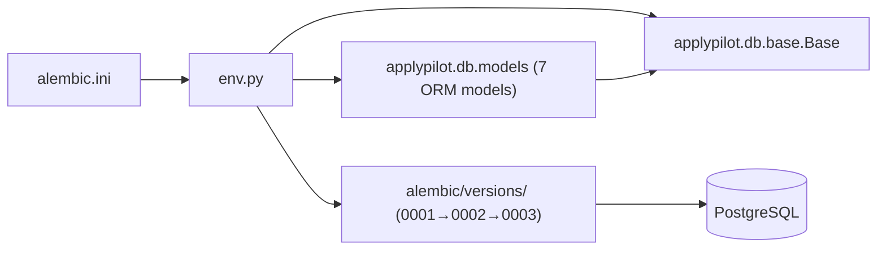

# C4 Code Level: Alembic Migration Environment

## Overview

- **Name**: Alembic Migration Environment
- **Description**: Configures the Alembic migration runtime to connect to PostgreSQL and discover SQLAlchemy ORM models for offline SQL generation and online schema migration.
- **Location**: `backend/alembic/`
- **Language**: Python
- **Purpose**: Bridge between Alembic's migration runner and the ApplyPilot SQLAlchemy metadata. Loads all ORM models so Alembic can detect schema drift and apply migrations.

---

## Code Elements

### env.py

**Location:** `backend/alembic/env.py`

#### Module-level setup (lines 1–16)
- Configures Python logging from `alembic.ini`
- Imports `applypilot.db.base.Base` for SQLAlchemy metadata
- Imports `applypilot.db.models` (noqa F401) — **side-effect import** registering all ORM models with `Base.metadata`
- Sets `target_metadata = Base.metadata`

#### `run_migrations_offline() -> None` (line 19)
Generates SQL without a live database connection.

| Config | Value |
|--------|-------|
| `url` | From `alembic.ini sqlalchemy.url` |
| `literal_binds` | `True` — inline SQL parameters |
| `compare_type` | `True` — detect column type changes |

#### `run_migrations_online() -> None` (line 29)
Connects to PostgreSQL and applies migrations transactionally using `NullPool`.

**Steps:** `engine_from_config` → `connectable.connect()` → `context.configure(connection, target_metadata, compare_type=True)` → `context.begin_transaction()` → `context.run_migrations()`

#### Branch selection (lines 40–43)
```python
if context.is_offline_mode():
    run_migrations_offline()
else:
    run_migrations_online()
```

---

## Dependencies

### Internal
- `applypilot.db.base.Base` — DeclarativeBase providing `metadata`
- `applypilot.db.models` — 7 ORM model classes (side-effect registration)

### External
- `alembic` — Migration framework (`context`)
- `sqlalchemy` — `engine_from_config`, `pool.NullPool`
- `logging.config.fileConfig` — Python stdlib logging
- `alembic.ini` — Configuration file with `sqlalchemy.url`

---

## Relationships


