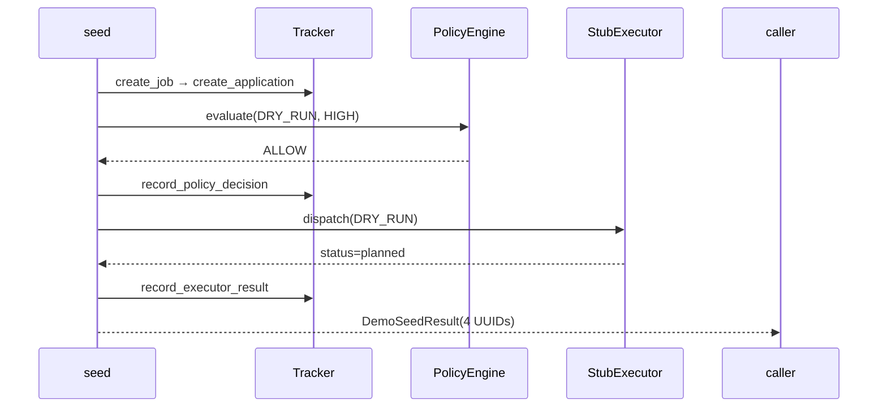

# C4 Code Level: Development Utilities

## Overview

- **Name**: Demo Seed Utility
- **Description**: Creates a complete demo audit trail — job, application, policy decision, dry-run executor action — for dashboard review and M1 validation.
- **Location**: `backend/src/applypilot/dev/`
- **Language**: Python
- **Purpose**: Seed a realistic demonstration of the full M1 workflow so developers and reviewers can inspect the audit dashboard without manually running each API step.

---

## Code Elements

### demo_seed.py

**Location:** `backend/src/applypilot/dev/demo_seed.py`

#### `DemoSeedResult` dataclass (lines 16–22)
`@dataclass(frozen=True, slots=True)` — immutable result with four UUIDs.

| Field | Type |
|-------|------|
| `job_id` | `UUID` |
| `application_id` | `UUID` |
| `policy_decision_id` | `UUID` |
| `executor_action_id` | `UUID` |

#### `seed_demo_application(tracker: Tracker, *, executor: StubExecutor | None = None) -> DemoSeedResult` (line 25)
Creates one complete demo audit trail. Injectable `executor` enables testing.

**Workflow:**
1. `tracker.create_job(JobCreate(...))` — Platform Engineer, Remote, Lever ATS, $95k-$125k
2. `tracker.create_application(...)` — MANUAL automation mode
3. Build `PolicyRequest(mode=AutomationMode.DRY_RUN)` with high-confidence context
4. `PolicyEngine().evaluate(policy_request)` → ALLOW decision
5. `tracker.record_policy_decision(...)` — persist decision
6. Build `ExecutorRequest(mode=DRY_RUN, idempotency_key=f"demo-seed-{application.id}")`
7. `StubExecutor().dispatch(...)` → `status="planned"`
8. `tracker.record_executor_result(...)` — persist action
9. Return `DemoSeedResult`

Raises `RuntimeError` if policy unexpectedly blocks.

#### `main() -> None` (line 73)
CLI entry point. Opens `SessionLocal()`, runs seed workflow, commits, prints dashboard URL.

---

## Dependencies

### Internal
- `applypilot.db.session.SessionLocal`
- `applypilot.db.tracker.Tracker`
- `applypilot.domain.applications.models.ApplicationCreate, JobCreate`
- `applypilot.domain.executor.ExecutionMode, ExecutorRequest`
- `applypilot.domain.policy` (AutomationMode, ConfidenceLevel, PolicyContext, PolicyEngine, PolicyRequest, WorkerType)
- `applypilot.services.executor_stub.StubExecutor`

### External
- `dataclasses`, `uuid` (stdlib)

---

## Relationships

