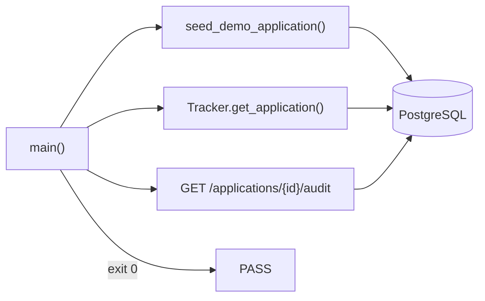

# C4 Code Level: Backend Validation Scripts

## Overview

- **Name**: Seed-to-Dashboard Validation Script
- **Description**: End-to-end integration validation script that exercises the complete M1 workflow against a live PostgreSQL database: demo seed → DB verification → API endpoint validation.
- **Location**: `backend/scripts/`
- **Language**: Python
- **Purpose**: Validate that `seed_demo_application()` creates correct records in PostgreSQL and that `/applications/{id}/audit` returns a complete audit summary. Exits 0 on success, 1 on failure.

---

## Code Elements

### validate_seed_to_dashboard.py

**Location:** `backend/scripts/validate_seed_to_dashboard.py`

#### `main() -> int` (line 24)
Orchestrates three validation phases against a live PostgreSQL database.

**Phase 1 — Seed (lines 32–51):**
- Opens `SessionLocal()` session
- Calls `seed_demo_application(Tracker(session))` creating job, application, policy decision, executor action
- Commits; captures `DemoSeedResult` (four UUIDs)

**Phase 2 — Database Verification (lines 54–78):**

| Assertion | Validates |
|-----------|-----------|
| `get_application(...)` not None | Application row exists |
| `application.state == "ApplicationCreated"` | State persisted |
| `"application.created" in event_types` | Creation event logged |
| `"policy_decision_logged" in event_types` | Policy event logged |
| `"executor_attempt_logged" in event_types` | Executor attempt logged |
| `"executor_result_logged" in event_types` | Executor result logged |
| `policy_decisions[0].allowed is True` | Policy allow flag |
| `executor_actions[0].status == "planned"` | Status = planned |
| `executor_actions[0].execution_mode == "dry_run"` | Mode = dry_run |

**Phase 3 — API Validation (lines 81–115):**
- Overrides `get_tracker_unit` FastAPI dependency with live session
- `TestClient(app)` makes HTTP requests
- `GET /applications/{id}/audit` → asserts `200` with full audit payload

---

## Dependencies

### Internal
- `applypilot.db.session.SessionLocal`
- `applypilot.db.tracker.Tracker`
- `applypilot.db.dependencies.TrackerUnitOfWork, get_tracker_unit`
- `applypilot.dev.demo_seed.seed_demo_application`
- `applypilot.main.app`

### External
- `fastapi.testclient.TestClient`
- `sys`

---

## Relationships



**Usage:**
```bash
docker compose up -d postgres
cd backend && alembic upgrade head
python -m scripts.validate_seed_to_dashboard
```
