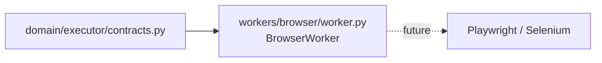

# C4 Code Level: Workers — Browser

## Overview

- **Name**: Browser Worker
- **Description**: Stub implementation of the browser automation worker. Placeholder for future Playwright/Selenium-based job application submission. Currently returns `status="not_implemented"` for all requests.
- **Location**: `backend/src/applypilot/workers/browser/`
- **Language**: Python
- **Purpose**: Reserve the executor contract slot for browser automation while M1 is in stub-only mode.

---

## Code Elements

### worker.py

**Location:** `backend/src/applypilot/workers/browser/worker.py`

#### `BrowserWorker`

Implements the executor contract.

#### `BrowserWorker.run(request: ExecutorRequest) -> ExecutorResult`

Stub — returns immediately with:
- `status = "not_implemented"`
- `details = {"worker": "browser", "mode": request.mode}`

---

## Dependencies

### Internal
- `applypilot.domain.executor.contracts.ExecutorRequest, ExecutorResult`

### External
None (Playwright not yet wired).

### Dependents
None in M1 — workers are not dispatched by the API; StubExecutor is used instead.

---

## Relationships

