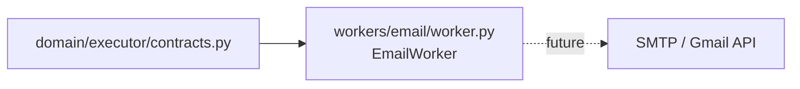

# C4 Code Level: Workers — Email

## Overview

- **Name**: Email Worker
- **Description**: Stub implementation of the recruiter email worker. Placeholder for future email classification and response drafting. Returns `status="not_implemented"` for all requests.
- **Location**: `backend/src/applypilot/workers/email/`
- **Language**: Python
- **Purpose**: Reserve the executor contract slot for email automation while M1 is in stub-only mode.

---

## Code Elements

### worker.py

**Location:** `backend/src/applypilot/workers/email/worker.py`

#### `EmailWorker`

Implements the executor contract.

#### `EmailWorker.run(request: ExecutorRequest) -> ExecutorResult`

Stub — returns immediately with:
- `status = "not_implemented"`
- `details = {"worker": "email", "mode": request.mode}`

---

## Dependencies

### Internal
- `applypilot.domain.executor.contracts.ExecutorRequest, ExecutorResult`

### External
None (email provider not yet wired).

### Dependents
None in M1 — StubExecutor used in place of real workers.

---

## Relationships

