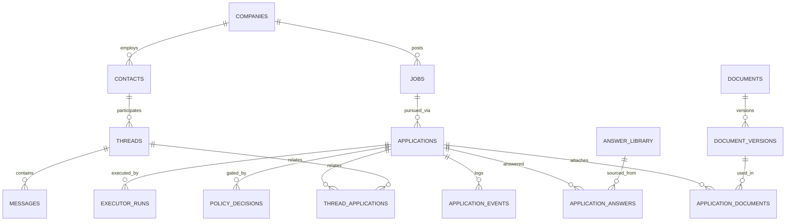

# ADR-0002-canonical-data-model

| Field | Value |
|-------|-------|
| **Status** | Proposed (revised to align with the implemented M1 baseline) |
| **Date** | 2026-06-14 |
| **Owner** | Nicolay (architecture) |
| **Reviewers required** | Nicolay + Francis (High risk — canonical data model) |
| **Related** | `docs/decisions/ADR-0001-architecture-operating-structure.md` (Approved); `docs/contracts/database-schema-contract.md` (implemented M1 baseline); Database & PostgreSQL Implementation Roadmap; `docs/architecture/OpenClaw_Final_Agreed_Architecture.pdf` |

> **Authority order:** architecture PDF → approved ADRs → `docs/architecture/` → `docs/contracts/`
> → `AGENTS.md` → chat. This ADR records *direction*. It does **not** authorize any migration; each
> phase below requires its own approved per-milestone schema contract and a High-risk sign-off.

---

## Status

**Proposed.** This revision aligns the canonical-data-model decision with the database as actually
implemented at M1 (real PostgreSQL, migrations `0001` through `0006`) and with the PostgreSQL Implementation
Roadmap. It corrects two over-eager positions in the initial ADR-0002 draft: pre-adding unused
executor retry columns, and treating table renames / sub-state splits as immediate M1 work. Both are
now deferred to the milestone and contract that actually need them.

---

## Context

### What is already implemented (M1 — DONE)

The M1 database is real, not mock data. Compose runs `postgres:16`; Alembic revisions `0001` through `0006`
create a seven-table aggregate; SQLAlchemy persists real rows; the demo seed and the
seed-to-dashboard validator run against PostgreSQL.

Implemented tables: `jobs`, `applications`, `documents`, `email_threads`, `policy_decisions`,
`executor_actions`, `event_log`. `applications` is the central record.

Guarantees in place today:

- `applications.job_id` is a required foreign key.
- `executor_actions.idempotency_key` is unique in PostgreSQL.
- State changes pass through the state machine in application code.
- A policy decision is recorded before the dry-run executor action.
- Executor request metadata is persisted on executor actions.
- `event_log` has **no** delete cascade from `applications`, and the ORM does not orphan-delete events.
- Migration `0004` aligns the application state default with `ApplicationCreated`.
- Migration `0006` enforces stable M1 values with named PostgreSQL `CHECK` constraints.
- Implemented M1 states: `ApplicationCreated`, `Draft`, `ReadyForReview`, `Approved`, `Submitted`,
  `Rejected`, `Archived`.

### Known M1 boundaries (intentional, not drift)

- `policy_decisions` and `executor_actions` still cascade on application deletion.
- `jobs.company` is a nullable string, not a normalized company foreign key.
- `documents` and `email_threads` are single-application-owner placeholders.
- No retry / backoff / rate-limit fields exist.
- Compose has no health check, migration service, or seed service.

These are deliberate scope boundaries for the M1 spine, not evidence of an incorrect schema.

### Why a richer model is still needed

The M1 spine is enough to prove the control plane, but it is too thin for the full domain, and the
thinness produces two failure modes once the later milestones land:

1. **Domain nouns have nowhere to live.** Companies own jobs; recruiters recur across conversations;
   a tailored CV is versioned and reused across applications; one recruiter thread can touch several
   applications; screening answers are worth reusing. In M1 these are absent or bolted onto a single
   owner — acceptable now, untenable at M3/M5/M7.
2. **One `state` column would eventually do the work of several lifecycles.** An application
   coordinates scoring, the document packet, submission, and the recruiter conversation, each at its
   own state. A single linear enum cannot express "packet ready, submission failed, recruiter
   replied" without either combinatorial enum growth or smearing truth across the event log — which
   would break the principle that the database, not the audit trail, owns truth.

### Scope correction this revision makes

The initial ADR-0002 draft said "define the full model now and pre-create executor retry columns
even while unused." The roadmap reframes that: an ADR records *direction*; safe migrations require a
*per-milestone contract*; and fields that imply behavior (retry, backoff, rate limits) should arrive
with that behavior and its tests, not as dead columns. This revision adopts that discipline.

---

## Decision

Adopt the **richer relational model with first-class entities and sub-lifecycle states** as the
**target direction**, realized through **milestone-phased migrations**, where **each phase is gated
behind its own approved schema contract and High-risk sign-off**. The implemented M1 baseline stands;
its placeholders are intentional and are replaced only when the owning milestone's contract is
approved.

Rejected alternatives: keeping the thin model and adding loose columns (orphans jobs, cannot express
the two many-to-many relationships, leaks truth into the event log); and an event-sourced model
(fights "database owns truth," explicitly banned by the locked plan).

### Target entities and the two load-bearing relationships

The two relationships that justify the change are genuine many-to-many and cannot be a single FK:

- **`document_versions` ↔ `applications`** via `application_documents` — one tailored CV version is
  reused across applications; one application attaches several documents.
- **`threads` ↔ `applications`** via `thread_applications` — one recruiter thread can concern more
  than one application.

### Phased rollout (direction only — not an authorization to migrate)

| Phase | Milestone | Scope | Status |
|-------|-----------|-------|--------|
| **0** | M1 (now) | Seven-table aggregate, migrations `0001` through `0006` | **DONE** |
| **0.5** | M1 hardening | Policy/executor retention; reproducible migration startup | **NEXT — retention proposed in ADR-0004** |
| **1** | M3 | Normalize `companies`; `jobs.company_id` FK; preserve source company text for provenance | **FUTURE — contract D required first** |
| **2** | M5 | `documents`, `document_versions`, `application_documents`, `answer_library`, `application_answers` (the document↔application M—N) | **FUTURE — contract G required first** |
| **3** | M7 | `contacts`, `threads`, `messages`, `thread_applications`, `threads.conversation_state` (the thread↔application M—N) | **FUTURE — contract H required first** |
| **4** | Later | Executor hardening: `attempt`, `max_attempts`, `rate_limit_key`, `last_error`, `next_retry_at`, and any `executor_actions → executor_runs` rename | **FUTURE — contract I required first** |

Do not pull M3, M5, M7, or executor hardening into an M1 hardening migration.

### Adjustments from the initial ADR-0002 draft (explicit)

1. **Executor retry/idempotency fields are deferred to Phase 4.** They land *with* retry semantics
   and tests, not as unused M1 columns. M1 keeps only the already-implemented unique `idempotency_key`.
2. **Table renames are future and contract-gated.** `executor_actions → executor_runs` (and any
   audit-table rename) happen via `op.rename_table` in the owning phase, never drop-and-recreate, and
   never in M1 hardening.
3. **Sub-lifecycle states and the headline-enum question are out of scope for this ADR.** Do not
   rename `applications.state` or add `lifecycle_state` / `packet_state` / `submission_state` /
   `threads.conversation_state` until a dedicated **lifecycle & transition ADR** is approved (the
   implemented `ApplicationCreated…Archived` set differs from the PDF set and must be reconciled there,
   including whether the headline state is stored or derived). Fine-grained execution status must not
   be forced into the headline workflow state.
4. **M1 hardening is a separate track** (value checks, audit retention, and migration startup) from M3/M5/M7
   normalization, and precedes none of them as a dependency.

### Decisions still required before M1 hardening (Phase 0.5)

- **Policy/executor retention** — `policy_decisions` and `executor_actions` currently cascade on
  application deletion, which weakens audit. ADR-0004 proposes restrictive physical deletion for M1
  and preserving events, policy decisions, and executor records. Implementation still requires a
  dedicated migration and tests.

---

## Consequences

**Positive**

- Current truth of each lifecycle remains a `SELECT`, never a log replay — "database owns truth" holds.
- Document reuse and shared recruiter threads become expressible (the two M—N relationships) instead
  of impossible.
- The governance spine — state machine, append-only audit, policy gate, executor contract, dry-run —
  is untouched; this is additive, not a rewrite, and reopens no settled boundary.
- Full-auto guardrails (idempotency, retry, rate limits) have a defined home (Phase 4) and arrive with
  behavior and tests, avoiding dead columns.

**Costs / risks**

- More tables and a few joins to design, each behind its own contract and migration.
- Three-to-four phased High-risk migrations, each needing sign-off and backfill/rollback discipline.
- The headline-enum reconciliation is split into a separate ADR and remains an open dependency for any
  future sub-state work.

**Constraints (binding on every phase)**

- Each migration must prove: fresh-DB upgrade through every revision; representative existing data
  survives; constraints reject invalid writes; deletion/retention behavior is database-enforced;
  API/dashboard compatibility holds; `ruff`, `pytest`, and seed-to-dashboard validation pass.
- Renames use rename operations; destructive column removal only after the replacement is populated
  and consumers have switched.
- No deletion policy may erase proof that an action was permitted and attempted.

**Explicitly not decided here**

- No microservices, service-per-aggregate, message bus, or queue beyond the already-planned Redis.
- No event-sourcing framework; `application_events` stays a plain append-only audit table.
- No headline-state rename, no sub-state columns (separate lifecycle & transition ADR).
- No executor retry columns until Phase 4.

---

## Supersedes

None. This is a revision of the initial Proposed ADR-0002 draft; it does not supersede any other ADR
or approved document. It revises the draft's stance on executor columns, renames, and sub-states to
match the implemented M1 baseline and the PostgreSQL Implementation Roadmap.

## Superseded by

None.
