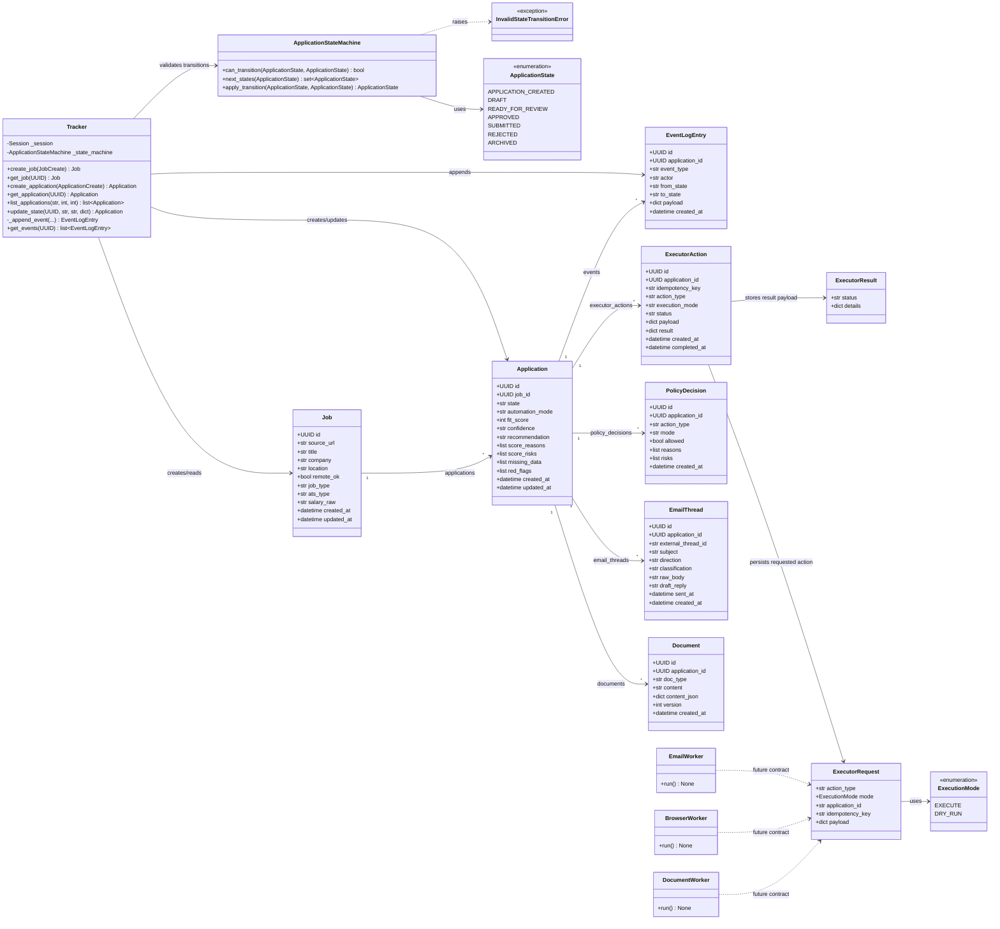

# Backend Class Diagram

Status: living implementation reference.

This diagram describes the current backend class and module shape. It is not an architecture authority. If this diagram conflicts with the locked architecture PDF, approved ADRs, contracts, or implemented behavior, those sources win and this diagram should be updated.

## Current Backend Shape

## Notes

- The ORM model is centered on `Application` as the canonical hub record.
- `Tracker` is the current repository boundary for creating jobs, creating applications, listing applications, updating state, and appending event log entries.
- `ApplicationStateMachine` owns transition validation. Invalid transitions raise `InvalidStateTransitionError`.
- `ExecutorRequest`, `ExecutorResult`, and `ExecutionMode` define the current executor contract shape, while worker implementations remain stubs in M1.
- This diagram should be refreshed when backend classes, relationships, or major methods change.
