# Backend Class Diagram

Status: living implementation reference.

This diagram describes the current backend class and module shape. It is not an architecture authority. If this diagram conflicts with the locked architecture PDF, approved ADRs, contracts, or implemented behavior, those sources win and this diagram should be updated.

## Current Backend Shape

```mermaid
classDiagram
    direction LR

    class ApiRouter {
        +create_job(JobCreate) JobRead
        +create_application(ApplicationCreate) ApplicationRead
        +list_applications(filters) list~ApplicationRead~
        +update_application_state(UUID, ApplicationStateUpdate) ApplicationRead
        +score_application(UUID, ApplicationScoreRequest) ApplicationRead
        +evaluate_application_policy(UUID, PolicyEvaluationRequest) PolicyDecisionRead
        +dry_run_executor_action(UUID, ExecutorDryRunRequest) ExecutorActionRead
        +list_application_events(UUID) list~EventLogRead~
        +get_application_audit_summary(UUID) ApplicationAuditRead
        +get_application_review_summary(UUID) ApplicationReviewSummaryRead
    }

    class TrackerUnitOfWork {
        +Tracker tracker
        +commit() None
        +refresh(object) None
    }

    class Tracker {
        -Session _session
        -ApplicationStateMachine _state_machine
        +create_job(JobCreate) Job
        +get_job(UUID) Job
        +create_application(ApplicationCreate) Application
        +get_application(UUID) Application
        +list_applications(filters) list~Application~
        +update_state(UUID, str, str, dict) Application
        +submit_application(UUID, str, dict) Application
        +score_application(UUID, str) Application
        +record_policy_decision(PolicyRequest, PolicyDecision, str) PolicyDecisionRecord
        +get_policy_decision(UUID) PolicyDecisionRecord
        +get_policy_decisions(UUID) list~PolicyDecisionRecord~
        +record_executor_result(ExecutorRequest, ExecutorResult, str) ExecutorAction
        +get_executor_actions(UUID) list~ExecutorAction~
        +get_events(UUID) list~EventLogEntry~
        -_ensure_submission_prerequisites(UUID) None
        -_executor_matches_allowed_policy(ExecutorAction, set) bool
        -_append_event(...) EventLogEntry
    }

    class Job {
        +UUID id
        +str source_url
        +str raw_text
        +str title
        +str company
        +str location
        +bool remote_ok
        +str job_type
        +str ats_type
        +str salary_raw
        +datetime created_at
        +datetime updated_at
    }

    class Application {
        +UUID id
        +UUID job_id
        +str state
        +str automation_mode
        +int fit_score
        +str confidence
        +str recommendation
        +list score_reasons
        +list score_risks
        +list missing_data
        +list red_flags
        +datetime created_at
        +datetime updated_at
    }

    class Document {
        +UUID id
        +UUID application_id
        +str doc_type
        +str content
        +dict content_json
        +int version
        +datetime created_at
    }

    class EmailThread {
        +UUID id
        +UUID application_id
        +str external_thread_id
        +str subject
        +str direction
        +str classification
        +str raw_body
        +str draft_reply
        +datetime sent_at
        +datetime created_at
    }

    class PolicyDecisionRecord {
        +UUID id
        +UUID application_id
        +str action_type
        +str mode
        +str decision
        +bool allowed
        +list reasons
        +list risks
        +list required_overrides
        +datetime created_at
    }

    class ExecutorAction {
        +UUID id
        +UUID request_id
        +UUID application_id
        +str worker
        +str idempotency_key
        +str action_type
        +str execution_mode
        +str status
        +str requested_by
        +datetime requested_at
        +dict payload
        +dict result
        +datetime created_at
        +datetime completed_at
    }

    class EventLogEntry {
        +UUID id
        +UUID application_id
        +str event_type
        +str actor
        +str from_state
        +str to_state
        +dict payload
        +datetime created_at
    }

    class JobCreate {
        +normalize_source_url()
        +normalize_short_text()
        +require_useful_intake()
    }

    class ApplicationRead {
        +UUID id
        +JobRead job
        +ApplicationState state
        +int fit_score
        +str recommendation
    }

    class ApplicationAuditRead {
        +ApplicationRead application
        +list~EventLogRead~ events
        +list~PolicyDecisionRead~ policy_decisions
        +list~ExecutorActionRead~ executor_actions
    }

    class ApplicationReviewSummaryRead {
        +ApplicationRead application
        +PolicyDecisionRead latest_policy_decision
        +ExecutorActionRead latest_executor_action
        +int event_count
        +list~str~ next_states
        +bool ready_for_policy
        +bool ready_for_dry_run
        +bool ready_for_submission
    }

    class JobIntakeClassifier {
        +enrich(JobCreate) JobCreate
        +classify(JobCreate) JobIntakeClassification
    }

    class ApplicationScorer {
        +score(JobScoringInput) ScoringResult
    }

    class PolicyEngine {
        +evaluate(PolicyRequest) PolicyDecision
    }

    class PolicyRequest {
        +UUID application_id
        +str current_state
        +str requested_action
        +WorkerType worker
        +PolicyContext context
        +AutomationMode mode
    }

    class PolicyDecision {
        +PolicyDecisionOutcome decision
        +AutomationMode mode
        +list reasons
        +list required_overrides
        +UUID decision_id
        +bool allowed
    }

    class ExecutorRequest {
        +UUID request_id
        +str action_type
        +ExecutionMode mode
        +str application_id
        +str worker
        +str idempotency_key
        +str requested_by
        +datetime requested_at
        +dict payload
        +create() ExecutorRequest
    }

    class ExecutorResult {
        +UUID request_id
        +str application_id
        +str worker
        +ExecutionMode mode
        +str status
        +dict details
        +str error_code
        +str error_message
        +datetime completed_at
    }

    class StubExecutor {
        +dispatch(ExecutorRequest) ExecutorResult
    }

    class ApplicationState {
        <<enumeration>>
        APPLICATION_CREATED
        DRAFT
        READY_FOR_REVIEW
        APPROVED
        SUBMITTED
        REJECTED
        ARCHIVED
    }

    class ApplicationStateMachine {
        +can_transition(ApplicationState, ApplicationState) bool
        +next_states(ApplicationState) set~ApplicationState~
        +apply_transition(ApplicationState, ApplicationState) ApplicationState
    }

    class InvalidStateTransitionError {
        <<exception>>
    }

    class ExecutionMode {
        <<enumeration>>
        EXECUTE
        DRY_RUN
    }

    class AutomationMode {
        <<enumeration>>
        MANUAL
        DRY_RUN
        SEMI_AUTO
        FULL_AUTO
    }

    class EmailWorker {
        +run() None
    }

    class BrowserWorker {
        +run() None
    }

    class DocumentWorker {
        +run() None
    }

    Job "1" --> "*" Application : applications
    Application "1" --> "*" Document : documents
    Application "1" --> "*" EmailThread : email_threads
    Application "1" --> "*" PolicyDecisionRecord : policy_decisions
    Application "1" --> "*" ExecutorAction : executor_actions
    Application "1" --> "*" EventLogEntry : events

    ApiRouter --> TrackerUnitOfWork : uses
    TrackerUnitOfWork --> Tracker : exposes
    Tracker --> Job : creates/reads
    Tracker --> Application : creates/updates
    Tracker --> EventLogEntry : appends
    Tracker --> PolicyDecisionRecord : records
    Tracker --> ExecutorAction : records
    Tracker --> JobIntakeClassifier : enriches intake
    Tracker --> ApplicationScorer : scores applications
    Tracker --> ApplicationStateMachine : validates transitions
    Tracker ..> InvalidStateTransitionError : raises

    ApplicationRead --> Job : embeds job
    ApplicationAuditRead --> ApplicationRead : summarizes
    ApplicationAuditRead --> EventLogEntry : includes
    ApplicationAuditRead --> PolicyDecisionRecord : includes
    ApplicationAuditRead --> ExecutorAction : includes
    ApplicationReviewSummaryRead --> ApplicationRead : summarizes
    ApplicationReviewSummaryRead --> PolicyDecisionRecord : latest decision
    ApplicationReviewSummaryRead --> ExecutorAction : latest action

    ApplicationStateMachine --> ApplicationState : uses
    JobIntakeClassifier --> JobCreate : normalizes
    ApplicationScorer --> Job : reads normalized job fields
    PolicyEngine --> PolicyRequest : evaluates
    PolicyDecision --> AutomationMode : uses
    Tracker --> PolicyDecision : persists outcome

    ApiRouter --> StubExecutor : dry-run dispatch
    StubExecutor --> ExecutorRequest : accepts
    StubExecutor --> ExecutorResult : returns
    ExecutorRequest --> ExecutionMode : uses
    ExecutorAction --> ExecutorRequest : persists requested action
    ExecutorAction --> ExecutorResult : stores result payload

    EmailWorker ..> ExecutorRequest : future contract
    BrowserWorker ..> ExecutorRequest : future contract
    DocumentWorker ..> ExecutorRequest : future contract
```

## Notes

- The ORM model is centered on `Application` as the canonical hub record.
- `ApiRouter` exposes the current M1 workflow: manual job intake, application creation, scoring, policy evaluation, dry-run executor dispatch, event/audit reads, and the compact review summary.
- `Tracker` is the current repository and orchestration boundary for creating jobs, creating applications, listing/filtering applications, scoring, recording policy decisions, recording executor results, appending audit events, and protecting the `Submitted` transition.
- `ApplicationStateMachine` owns transition validation. `Submitted` also requires `Tracker.submit_application`, an allowed policy decision, and matching executor evidence.
- `PolicyEngine` and `ApplicationScorer` are deterministic. No LLM or external service is required for the implemented M1 scoring or policy path.
- `ExecutorRequest`, `ExecutorResult`, `ExecutionMode`, and `StubExecutor` define the current dry-run executor contract shape, while worker implementations remain stubs in M1.
- This diagram should be refreshed when backend classes, relationships, or major methods change.
