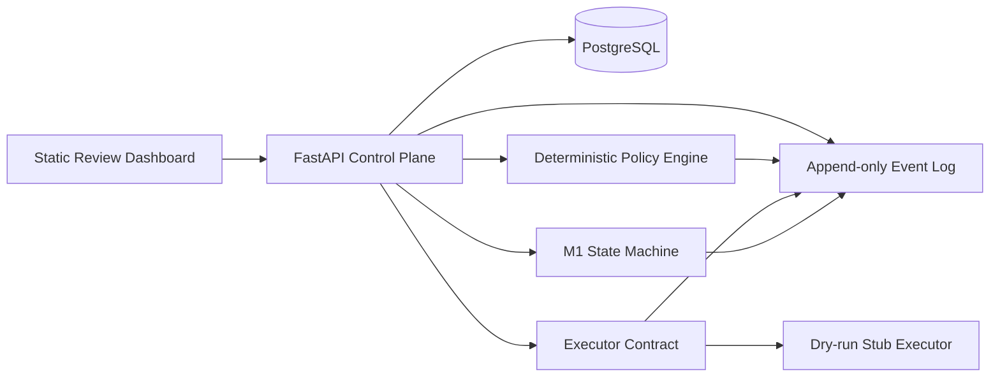
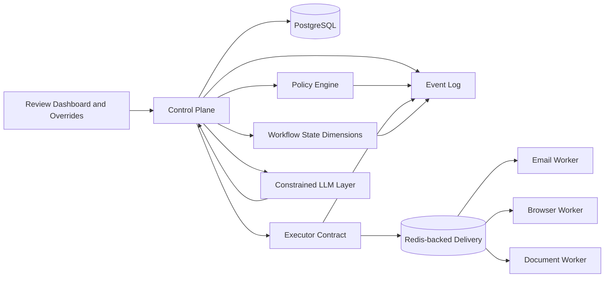

# Component Diagrams

## Implemented M1

Redis is provisioned by Compose, but no queue dispatcher or live outbound worker execution is
implemented in M1.

## Future Architecture - Planned / Not Implemented

## Notes
- Workflow owns state transitions.
- Database remains canonical source of truth.
- Workers only execute approved structured commands.
- Dry-run and execute share the same executor contract.
- Queue delivery, real workers, and LLM integration require their milestone contracts before
  implementation.
