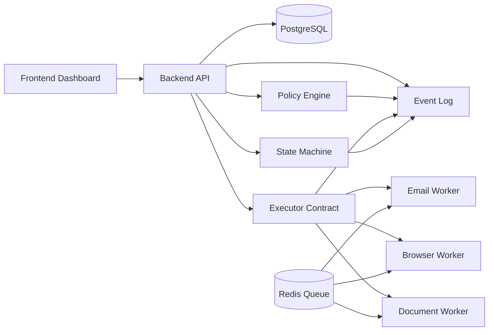

# Component Diagram

## Notes
- Workflow owns state transitions.
- Database remains canonical source of truth.
- Workers only execute approved structured commands.
- Dry-run and execute share the same executor contract.