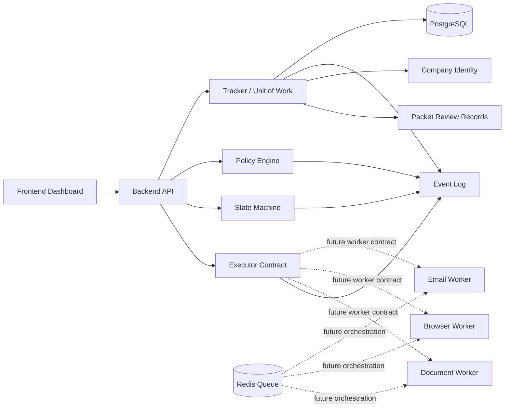

# Component Diagram

## Notes
- Workflow owns state transitions.
- Database remains canonical source of truth.
- Workers only execute approved structured commands.
- Dry-run and execute share the same executor contract.
- Company identity and packet review persistence are implemented inside the current monolith.
- Worker implementations and Redis-backed orchestration remain later-phase contracts/stubs.
