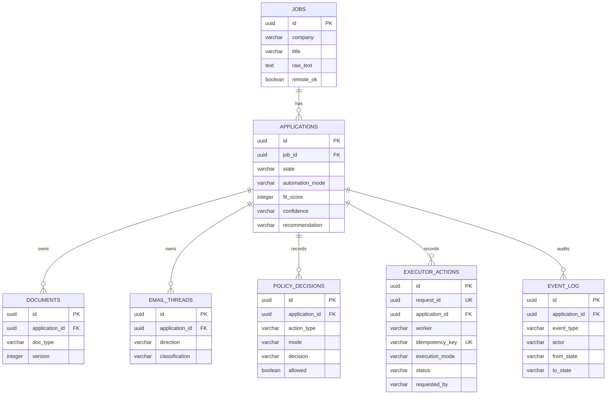
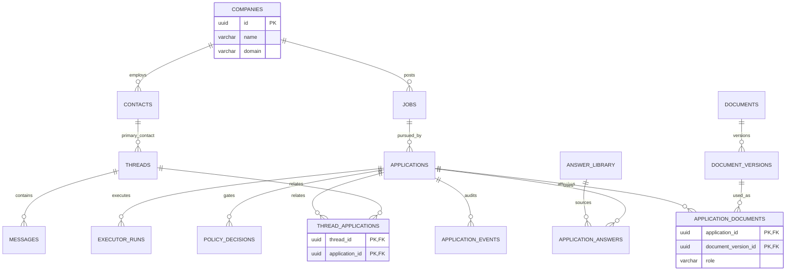

# Database Schema Views

These diagrams intentionally separate implemented M1 behavior from proposed future design.
Diagrams are explanatory artifacts; models, migrations, contracts, and approved ADRs remain higher
authority.

## Current M1 Schema

**Status: Implemented**

See `docs/contracts/database-schema-contract.md` for complete column and constraint details.

## Future Data Model

**Status: Planned / Not Implemented**

This view records the proposed normalization direction in ADR-0002. It is not a description of the
current database and does not authorize migrations.

## Phase Boundary

- M1 keeps the current seven-table aggregate.
- M3 may normalize companies.
- M5 may introduce packet/document version and answer entities.
- M7 may introduce contacts, messages, and many-to-many recruiter threads.
- Executor retry/backoff and table naming changes require a separately approved migration.
