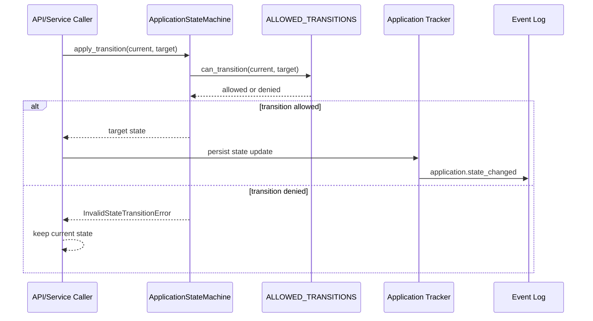
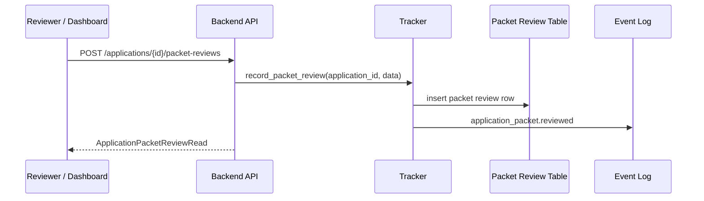
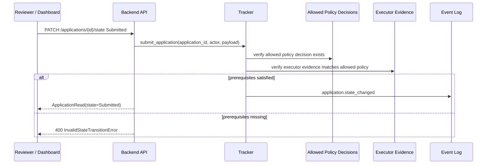

# Workflow Validation Sequences

## Invariants
- Callers must validate transitions through the state machine boundary.
- Invalid transitions do not mutate application state.
- Persisted state changes must emit an append-only event log entry.
- Packet review decisions persist as reviewer evidence and append `application_packet.reviewed`.
- `Submitted` requires the dedicated submit workflow plus allowed policy and matching executor evidence.
- Packet review evidence is exposed through the review summary, but it is not yet a database-enforced
  submission prerequisite.
