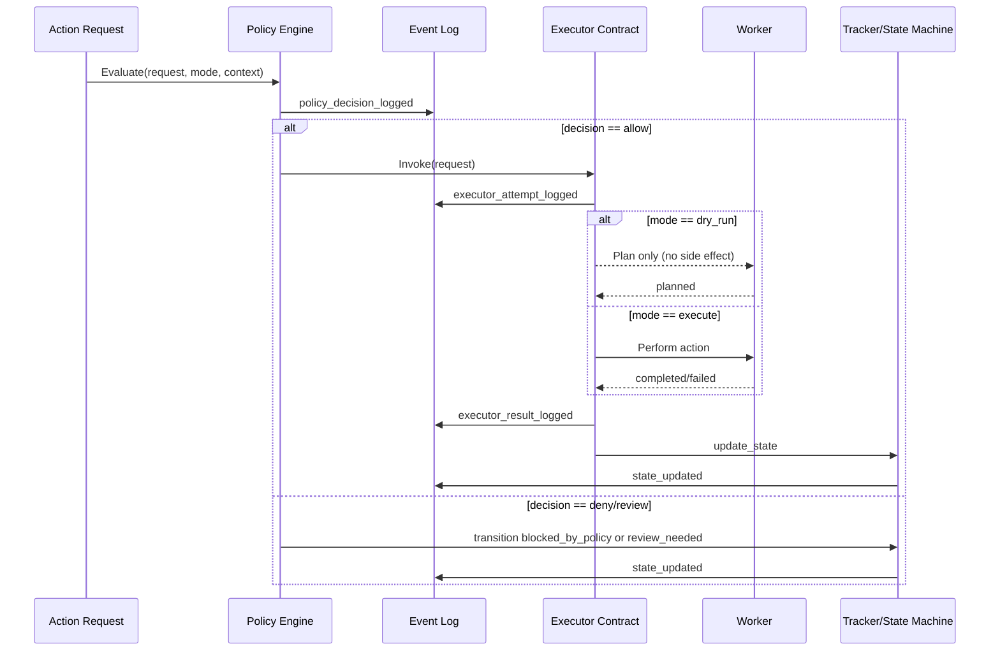

# Policy and Execution Sequence

## Invariants
- Policy decision is logged before any executor call.
- Dry-run and execute use identical command shape.
- Idempotency key is required for executor actions.