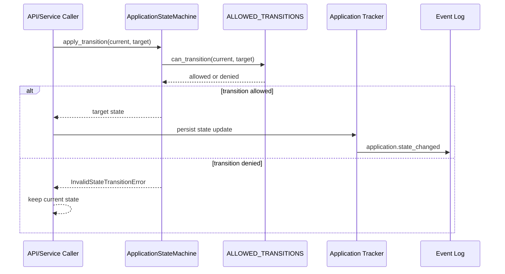

# State Transition Validation Sequence

## Invariants
- Callers must validate transitions through the state machine boundary.
- Invalid transitions do not mutate application state.
- Persisted state changes must emit an append-only event log entry.
- Policy and executor flows remain separate contracts layered around this transition boundary.
