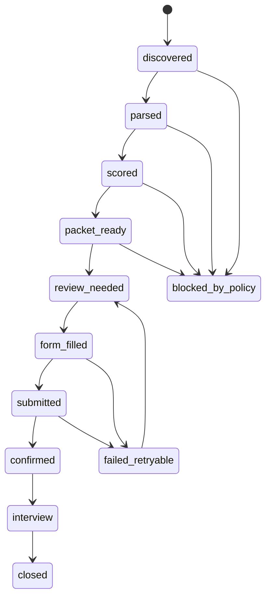

# Application State Machine

```mermaid
stateDiagram-v2
    [*] --> discovered
    discovered --> parsed
    parsed --> scored
    scored --> packet_ready
    packet_ready --> review_needed

    review_needed --> form_filled
    form_filled --> submitted
    submitted --> confirmed
    confirmed --> interview
    interview --> closed

    discovered --> blocked_by_policy
    parsed --> blocked_by_policy
    scored --> blocked_by_policy
    packet_ready --> blocked_by_policy
    form_filled --> failed_retryable
    submitted --> failed_retryable

    failed_retryable --> review_needed
```

## Fallback States
- `review_needed` for uncertainty and missing data.
- `blocked_by_policy` for denied actions.
- `failed_retryable` for transient worker/API failures.