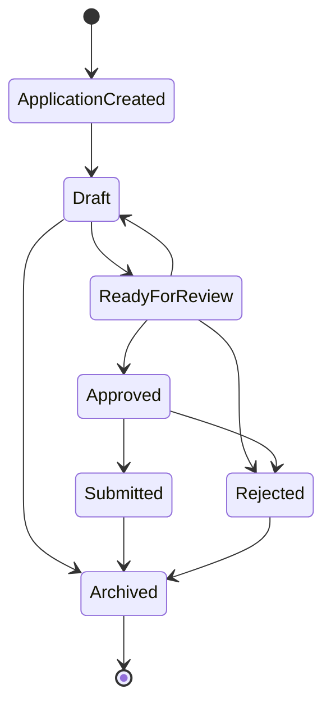
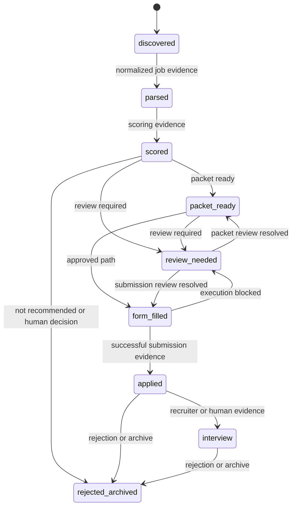

# Application State Models

## Implemented M1 State Machine

## Transition Table

| Current state | Allowed next states |
| --- | --- |
| `ApplicationCreated` | `Draft` |
| `Draft` | `ReadyForReview`, `Archived` |
| `ReadyForReview` | `Approved`, `Rejected`, `Draft` |
| `Approved` | `Submitted`, `Rejected` |
| `Submitted` | `Archived` |
| `Rejected` | `Archived` |
| `Archived` | None |

## M1 Rules

- New applications start in `ApplicationCreated`.
- `Archived` is terminal.
- Invalid transitions are rejected by `ApplicationStateMachine.apply_transition`.
- The source of truth for allowed transitions is `ALLOWED_TRANSITIONS`.

## Proposed Future Headline Projection - Not Implemented

This diagram explains how the locked PDF vocabulary can be projected from independent lifecycle,
packet, submission, conversation, and review evidence. It is not a database enum or an authorized
migration.

Binding proposed values, transitions, actors, evidence, and failure behavior are recorded in
`docs/decisions/ADR-0006-lifecycle-state-model.md` and
`docs/contracts/lifecycle-transition-contract.md`.
