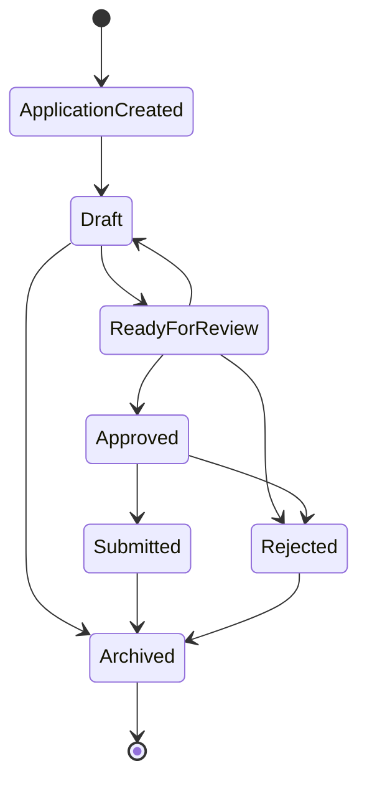

# Application State Machine

## Transition Table

| Current state | Allowed next states |
| --- | --- |
| `ApplicationCreated` | `Draft` |
| `Draft` | `ReadyForReview`, `Archived` |
| `ReadyForReview` | `Approved`, `Rejected`, `Draft` |
| `Approved` | `Submitted`, `Rejected` |
| `Submitted` | `Archived` |
| `Rejected` | `Archived` |
| `Archived` | None |

## M1 Rules

- New applications start in `ApplicationCreated`.
- `Archived` is terminal.
- Invalid transitions are rejected by `ApplicationStateMachine.apply_transition`.
- The source of truth for allowed transitions is `ALLOWED_TRANSITIONS`.
- `Submitted` still appears as an allowed state transition, but the implemented backend routes it
  through `Tracker.submit_application` so policy and executor evidence are verified before the state
  change is persisted.
